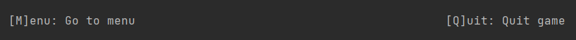

# Quizgame

A basic CLI quiz game where users select a category and they are prompted to answer questions related to that category.

# How to play:
### 1. Select category

### 2. Quiz starts
### 3. Select answer
### 4. If answer is correct display **Correct Answer** message

### 5. If answer is wrong display **Wrong Answer** message and correct option

### 6. When all questions for the category are answered, display results

### When all questions for the category are answered, display results

### Enter [M] to view categories && Enter [Q] to quit current game 

